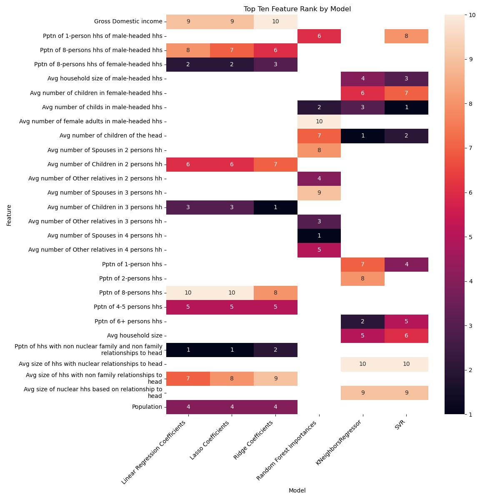

# CoResidence
## Project Description:

This project uses the “CoResidence” dataset, a recent study of household composition, combined with World Bank and United Nations demographic data, to study how household structure relates to economic well-being across countries and time. 

CoResidence is my capstone project as an autodidact in data science. My goal was to take a real-world, high-dimensional dataset—preferably complex panel data spanning decades—and treat it as if I had been assigned a forecasting task under realistic constraints.

In other words:

1) Assume the future must be predicted.
2) Assume missing values must be filled, not dropped.

In the formal data science courses that I took, .dropna() was almost always the first preprocessing step. And I almost always wondered: What if that weren’t an option? What if we actually had to use the data we were given?

This question is central in many real applications:

1) Econometrics, where demographic or country-level panels are incomplete or unevenly reported
2) Customer and business analytics, where CRM fields, transaction logs, or historical data are often missing or inconsistently collected
3) Operational forecasting, where you cannot discard imperfect inputs simply because they contain gaps

This is my first attempt to “walk down every path” inside a real-world data labyrinth. The forecasting portion of the project is not yet complete, but the data is now ready for it. Top features are robustly identified, forming the foundation for a future forecasting pipeline.

**Workflow Highlights**

This analysis examines how household composition relates to national prosperity (Gini Index) across countries and time. The workflow emphasizes:

1) Leakage-aware design (train-only scaling, ground-truth-only testing)
2) Time-series cross-validation
3) Comparative evaluation of imputation strategies
4) Use of TruncatedSVD both for imputation and for dimensionality reduction
5) Back-projection and back-allocation from latent components to native feature space

Of course, I did include a .dropna() baseline model for comparison. It produced reasonable scores, but the resulting design matrix contained far fewer observations and exhibited strong multicollinearity typical of macro-demographic indicators. Even after properly addressing compositional data, remaining features formed an effectively low-rank and ill-conditioned matrix.

**Model Comparison**

Multiple model classes were evaluated, including both linear and nonlinear approaches.

Feature importances for linear models were interpreted through back-projected coefficients. All models, regardless of linearity, were compared using allocated load on permutation importances (row-normalized squares), ensuring consistency across different model types.

## Model Comparison

As you can see, the baseline model (.dropna()) produced some of the best results, in terms of explanatory power (R2). This is likely due to the fact that countries with poor data quality were mostly dropped, by definition. Higher R2 values of the baseline model hid an underlying problem: Unstable matrix. Unstable matrices produce unreliable model results. Tiny changes to any value in an unstable matrix can cause your model to whip around wildly. Thus, dimensionality reduction was needed.

## Conclusion

Models produced encouraging results, in terms of showing the importance of household configuration to outcomes of wealth inequality. My fear when starting this project was that population and demographics features would dominate results, essentially showing that household configuration was an irrelevant. While GDP was the number one feature for linear signal, that was the only such feature.

Linear and Non-Linear Overlap:
1) Non-relatives in 3-5 person households
2) Non-relatives in male-headed households
3) Proportion of 4-5 person households

Linear Only:
1) GDP (number one for all three models)
2) The number of children, or the number of non-relatives, in small and medium sized households (2-5 persons)
3) The proportion of large (9-person) female-headed households

Non-Linear Only
SVR lacked broad overlap with KNN and RF. 
1) SVR: Household size, number of children in the household, and the fact that those children belonged to the head
2) KNN and RF: The number of non-relatives, and the number of spouses, in small and medium sized households 

Note:
My analysis looks at feature importances in a number of different ways. Here, I only report permutation importances, and not linear coefficients or Random Forest splitting criteria. Permutation importance measures predictive dependence. 

Permutation importances tell us which of the purified features are indispensable for prediction, once redundancy is taken into account. Thus, PI doesn't just tell us which features align with a certain vector direction in a subspace, they tell us which subspaces are the most indispensible to model performance.

Linear-Only Heatmap:

**Principal Componenent Composition**

# How to Run:
Conda python env
Don't run the final section "Addendum," because it takes forever, and it's just for fun.

 

