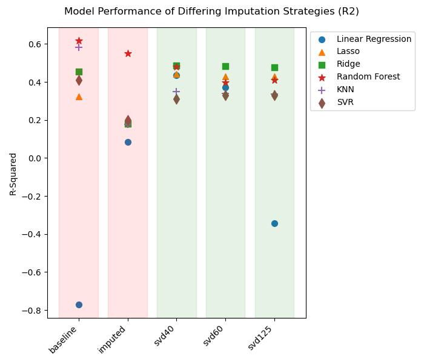

# CoResidence
## Project Description:

This project analyzes the [“CoResidence Database”](https://zenodo.org/records/8142652), a recent study of household composition. Data from the World Bank and United Nations is joined to the database for improved data quality. 

**The Question**: How does household configuration relate to economic well-being (Gini Index) across countries and time? 

CoResidence is my capstone project as an autodidact in data science. My goal was to take a real-world, high-dimensional dataset and treat it as if I had been assigned a forecasting task under realistic constraints.

In other words:

1) Assume the future must be predicted.
2) Assume missing values must be filled, not dropped.

In the formal data science courses that I took, .dropna() was almost always the first preprocessing step. And I usually wondered: What if line deletion weren’t an option? What if we actually had to use the data we were given?

This question is central in many real applications:

1) Econometrics, where demographic or country-level panels are incomplete or unevenly reported
2) Customer and business analytics, where CRM fields, transaction logs, or historical data are often missing or inconsistently collected
3) Operational forecasting, where you cannot discard imperfect inputs simply because they contain gaps

This is my first attempt to “walk down every path” inside a real-world data labyrinth. The forecasting portion of the project is a work in progress and will be featured in a separate PyTorch repo. Top features are robustly identified, forming the foundation for a forecasting pipeline.

**Workflow Highlights**

1) Leakage-aware design (train-only scaling, train-only SVD fitting, ground-truth-only testing)
2) Time-series cross-validation
3) Comparative evaluation of imputation strategies
4) Use of TruncatedSVD both for imputation and dimensionality reduction
5) Back-projection and back-allocation from latent components to native feature space

Of course, I did include a .dropna() baseline model for comparison. It produced reasonable scores on the surface, but the resulting design matrix contained far fewer observations and was ill-conditioned.

**Model Comparison**

Multiple model classes were evaluated, including both linear and nonlinear approaches.

All models, regardless of linearity, were compared using allocated load on permutation importances (row-normalized squares), ensuring consistency across different model types. I did include feature importances for linear models that were interpreted through back-projected coefficients, for comparison sake.

## Model Comparison

I used XGBoost as a baseline model, because XGBoost allows for NaN values and handles sparse matrices. This allowed me to provide a comparison to imputed values without being forced into row-deletion, in order to meet the requirements of a model that cannot digest null values. Matrix stability cannot be assessed where null values exist, because an eigenvalue-style decompsition cannot be performed, and thus the calculations for matrix condition cannot be performed. 

While the IterativeImputer dataset appears to have the best scores, the red vs. green fields indicate matrix stability. Iterative Imputer produced unstable matrices, which in turn produce unreliable model results.

## Conclusion

A complex dataset requires a complex conclusion. In the interest of simplicity, I distill the following insights:
1) GDP is important to wealth inequality in a linear way
2) The number of children, spouses, and non-relatives in medium sized households, are key indicators for Gini Index

Models produced encouraging results, in terms of showing the importance of household configuration features, to outcomes of wealth inequality. One fear I had when starting this project was that population and demographics features would dominate results, essentially showing that household configuration was not an interesting topic. While GDP was the top feature for linear signal, that was the only such feature. All other top features pertained to household configuration.

**Top Features by Signal-Type**

**Linear and Non-Linear Overlap:**
- Non-relatives in 3-5 person households
- Non-relatives in male-headed households
- Proportion of 4-5 person households

**Linear Only:**
- GDP (number one for all three models)
- The number of children, or the number of non-relatives, in small and medium sized households (2-5 persons)
- The proportion of large (9-person) female-headed households

**Non-Linear Only (SVR lacked any direct overlap with KNN and RF)**

SVR: 
- Household size,
- Number of children in the household
- Fact that those children belonged to the head

KNN and RF:
- The number of non-relatives
- The number of spouses, in small and medium sized households
- Proportion of male-headed households

Note:
My analysis looks at feature importances in a number of different ways. Here, I only report permutation importances, and not linear coefficients or Random Forest splitting criteria. 

**Principal Componenent Composition**

# How to Run:
Conda python env
Don't run the final section "Addendum," because it takes forever, and it's just for fun.

 

